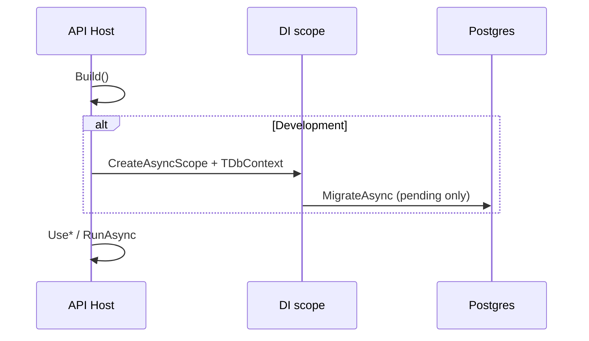

## Design

- **When:** `IWebHostEnvironment.IsDevelopment()` only (no automatic migrate in Staging/Production).
- **What:** `Database.MigrateAsync()` — applies pending migrations only; no-op when DB is current.
- **Where:** Right after `WebApplicationBuilder.Build()`, before HTTP middleware, via a scoped `TDbContext` from DI.

## Files

- New: `BuildingBlocks/Persistence/EfCoreDevelopmentMigrationExtensions.cs`
- Update: each `platform/services/*/*.Api/Program.cs` that calls `AddDbContext<>` for the service database (16 services).

## Out of scope

- `RealtimeDelivery.Api` (no EF `DbContext`).
- `RealtimePlatform.ApiGateway` (no EF).

