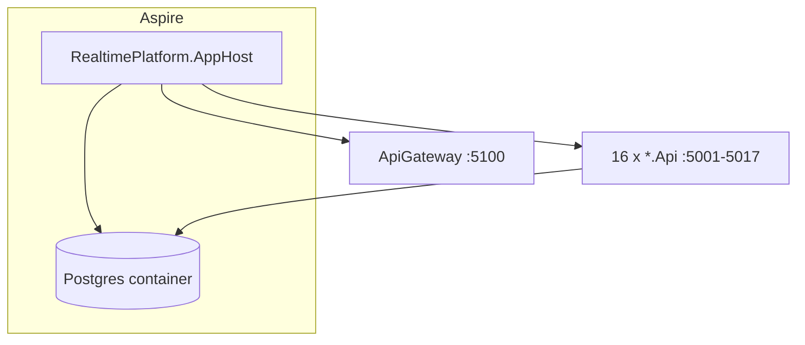

## Context

- YARP gateway uses fixed `localhost` ports; `AddProject` uses each API’s `launchSettings.json` URLs.
- Aspire resource names must use hyphens; PostgreSQL database names stay `*_dev` via `AddDatabase(resourceName, databaseName)`.
- `WithReference(db, "Default")` injects `ConnectionStrings:Default` for EF services.
- **First-time DBs** from Aspire are empty: apply EF migrations (or `scripts/dev-database-setup.sh` against the Aspire Postgres endpoint) before scenarios.
- Optional: add `ProjectReference` to `RealtimePlatform.ServiceDefaults` and call `builder.AddServiceDefaults()` / `app.MapDefaultEndpoints()` in any API that should use standardized HTTP client resilience + `/alive`.

## Mermaid

