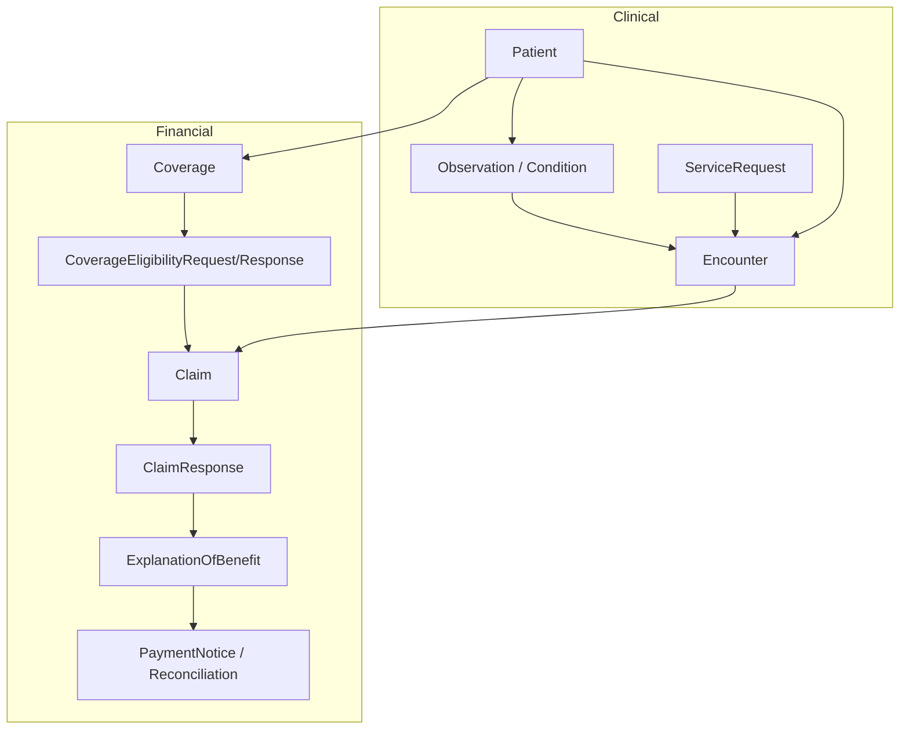
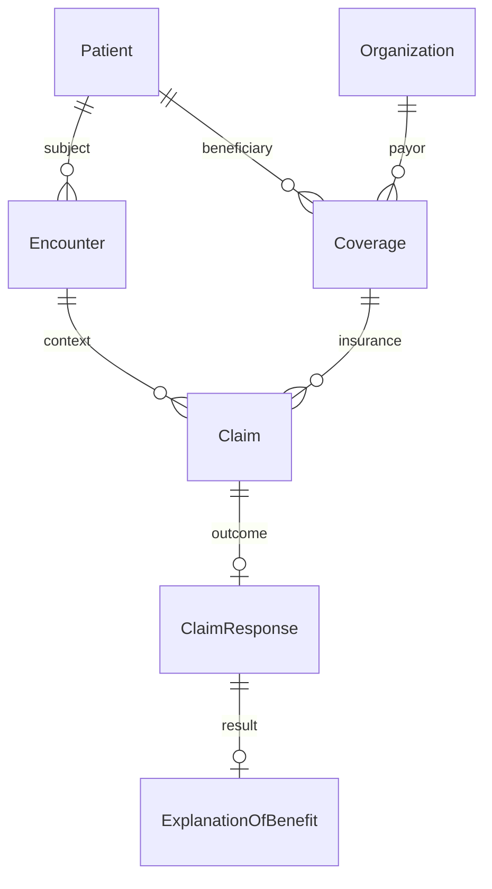

# FHIR clinical + financial “whole story”

## Dual journeys

| Stage   | Clinical (learning platform)                          | Financial (FHIR-first)                                                                                                                            |
| ------- | ----------------------------------------------------- | ------------------------------------------------------------------------------------------------------------------------------------------------- |
| Entry   | Symptoms, vitals, complaints (Observation, Condition) | **Coverage** (member id, plan, subscriber, payor **Organization**)                                                                                |
| Gate    | Diagnosis, care planning (Condition, ServiceRequest)  | **Prior authorization**: **CoverageEligibilityRequest/Response**, **Task** (DTR), optionally **Claim**/`use=preauthorization` + **ClaimResponse** |
| Service | **Encounter**/Procedure (dialysis treatment session)  | **Encounter** (or EpisodeOfCare) referenced on **Claim**; service codes on **Claim.item**                                                         |
| Outcome | Outcomes, reports (DiagnosticReport, Observation)     | **Claim** (institutional/professional) → **ClaimResponse**                                                                                        |
| Closure | Follow-up, end of episode                             | **ExplanationOfBenefit** (payer view of adjudication), **PaymentNotice** / **PaymentReconciliation** (cash application)                           |

FHIR links the two arcs with shared **Patient**, **Encounter**, and references from **Claim** / **ExplanationOfBenefit** back to the same **Encounter** and supporting clinical **Observation** identifiers where policy allows (often via **Claim.supportingInfo** or extensions, not a dump of all vitals).

## Core R4 resources (minimal set)

- **Coverage** — who is covered, under which plan, period, subscriber, payor, beneficiary (`beneficiary` → Patient).
- **Organization** — payer, provider, facility; **Organization** on **Coverage.payor**.
- **Encounter** — already part of the clinical story; financial artifacts should reference the same Encounter when billing the session.
- **CoverageEligibilityRequest / CoverageEligibilityResponse** — coverage active? benefits for a service type (eligibility/benefits check).
- **Task** — human/system steps for prior auth, document requests (often used with Da Vinci PAS/DTR patterns).
- **Claim** — submitted charges (institutional `Claim.type` or professional); **insurance** slice ties **Coverage**; **item** carries CPT/HCPCS/modifiers, quantity, unit price; `supportingInfo` for auth numbers, dates.
- **ClaimResponse** — adjudication outcome per claim; may reference an **ExplanationOfBenefit**.
- **ExplanationOfBenefit** — payer-agnostic explanation of benefits (items, adjudication, patient responsibility); patient-facing in consumer models (CARIN).

Optional later: **Account**, **Invoice** (cash only in many jurisdictions), **PaymentNotice**, **PaymentReconciliation**.

## Mermaid: parallel workflows

## Mermaid: reference linkage

## Alignment with this codebase

- **Clinical canonical FHIR** stays with **Clinical Interoperability** (Observation, publications, retry, audit). See `.cursor/plans/realtime_fhir_dialysis_implementation_plan.md` §8.8 and §16.
- **Financial FHIR** should be a **separate bounded context** (recommended name: **Financial Interoperability** or **RevenueCycleInterop**) so authorization, retention, and access control (C5, least privilege) can differ from clinical vitals paths. It can still share **BuildingBlocks** patterns (JWT, tenant, audit, correlation).
- **Treatment Session** / **Encounter** identifiers in the PDMS should be stable IDs that appear on **Claim** and **EOB** as `Encounter` reference or extension when the FHIR server assigns official Encounter resources.
- **Audit**: replicate the “record then map to AuditEvent” pattern for financial actions (**Claim** submit, **ClaimResponse** received, **EOB** disclosed).
- **React / gateway**: future UI for “billing status” reads **ExplanationOfBenefit** or internal read-models fed by EDI/FHIR ingestion—never the sole source of payment truth without payer sync rules.

## Jurisdictional note

Billing regulations (HIPAA transactions, X12 837/835, national billing profiles) often sit *beside* FHIR; many deployments use FHIR for **prior auth** and **member access** (EOB) while **Claim** maps from internal fee schedules to **837**. The plan assumes **FHIR as the interoperability and patient-story layer**, with explicit mapping/versioning where X12 remains system-of-record.

## Profile / IG direction (to refine in `profiles` todo)

- **US Core** instances for Patient, Coverage, Organization, Encounter where applicable.
- **Da Vinci** guides if you implement CRD / DTR / PAS for payer workflows.
- **CARIN Consumer Directed Exchange** if patients pull EOB-like data via FHIR API.

## Implementation order (when you start coding)

1. Read-model or FHIR proxy listing **Coverage** by Patient (tenant-scoped).
2. **Encounter** link from Treatment Session to external FHIR Encounter (or contained logical reference).
3. **Claim** + **ClaimResponse** lifecycle commands + idempotent payer callback handling.
4. **ExplanationOfBenefit** persistence and correlation to ClaimResponse + Encounter + SessionId for dashboards.

---

*This plan does not change runtime code until a follow-up implementation task is approved.*
