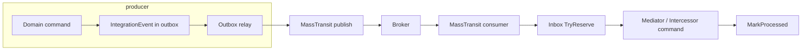

## Context

- Event contracts and §1 envelope live in [integration_event_catalog.md](integration_event_catalog.md) and existing `IntegrationEvent` / `IntegrationEventTransportSerializer`.
- Outbox relay today uses `ITransportPublisher` with a logging default ([envelope_and_outbox_relay.plan.md](envelope_and_outbox_relay.plan.md)).
- Inbox store exists (`RealtimePlatform.Outbox`) for idempotent processing.
- Workspace targets **net10.0**. **MassTransit v7** is a legacy major line and is not a practical choice for new work on current TFMs; this plan assumes **MassTransit 8.x** unless a written constraint mandates v7 (e.g. third-party package lock), in which case the constraint should be recorded and TFM alignment revisited.

### Licensing (v7 vs v8 vs v9)

- **MassTransit v7 and v8** are **free and open source** under **Apache License 2.0** (see [LICENSE](https://github.com/MassTransit/MassTransit/blob/develop/LICENSE) on the main repository).
- **MassTransit v9 and later** use a **commercial** license from Massient, Inc.; the project states that **v8 remains open-source** and that the commercial model applies to v9+ ([v9 announcement](https://masstransit.io/introduction/v9-announcement)).
- Choosing **v8.x** for this platform is consistent with staying on OSS; pinning a **maximum 8.x** line in central package management reduces accidental upgrades into v9 until licensing is explicitly approved.

## Architecture

- **Producers**: Keep emitting `IntegrationEvent` through the outbox; relay gains a real `MassTransit`-backed `ITransportPublisher` (or equivalent adapter) so bytes on the wire stay §1-compatible where required.
- **Consumers**: One `IConsumer<T>` (or one consumer class per message type) per **service** for each event type that service owns — matches [event-conventions.mdc](../rules/event-conventions.mdc) (single handler responsibility per event type per host).
- **In-process dispatch**: Consumers call existing `ICommand` handlers via Intercessor; do not fork domain rules in consumer bodies beyond mapping and audit.

## Transport choice (Azure / C5)

- Prefer **Azure Service Bus** with MassTransit (`MassTransit.Azure.ServiceBus.Core`) for alignment with C5-attested Azure foundation and existing `Azure.Messaging.ServiceBus` dependency in the repo.
- Alternative: RabbitMQ for local/dev via Aspire if Service Bus emulator cost is an issue; production path documented for Azure.

## Risks

- Envelope shape vs MassTransit default serialization: may need a custom serializer or publish raw JSON `byte[]` / `string` with explicit routing headers (`eventType`, `eventId`).
- Multi-tenant: propagate `X-Tenant-Id` / `facilityId` as headers or claim on the broker message and enforce in consumer.
- Versioning: `eventVersion` in §1 must drive compatible consumers or explicit dual-subscribe during migrations.

## Files likely touched

- `Directory.Packages.props`, project references for hosts that publish or consume.
- `platform/shared/RealtimePlatform.Outbox/` — MassTransit-backed transport publisher; optional MassTransit extensions project.
- Per-service `*.Api` `Program.cs` — `AddMassTransit`, consumer registration, health.
- New consumer classes under each service’s Application or Infrastructure layer (team convention).

## References

- [integration-event-saga-map.md](../../docs/platform/integration-event-saga-map.md) — first consumer chain priority.
- [integration_events_plan_considerations.plan.md](integration_events_plan_considerations.plan.md) — catalog governance.
