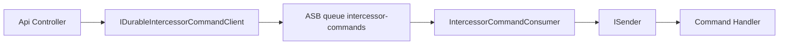

## Context

Intercessor `ISender` is in-process. HTTP handlers that call `SendAsync` lose work if the process dies before handling completes. MassTransit with Azure Service Bus provides broker persistence; failed deliveries surface as DLQ messages ([Azure Service Bus dead-letter](https://learn.microsoft.com/en-us/azure/service-bus-messaging/service-bus-dead-letter-queues)).

## Approach

1. **Envelope** – broker message carries assembly-qualified request type + JSON payload + optional correlation/tenant ids (API DTO boundary; not an `IRequest`).
2. **Publisher** – `IDurableIntercessorCommandClient` serializes an `IRequest`, sends to a dedicated queue (configured name, default `intercessor-commands`).
3. **Consumer** – `IConsumer<IntercessorCommandEnvelope>` resolves type, validates against allow-list, deserializes, invokes `ISender` via reflection for `IRequest` / `IRequest<TResponse>` (responses are discarded for durable enqueue).
4. **MassTransit** – `AddConsumer` with explicit endpoint queue name; **Azure** branch calls `ConfigureEndpoints(context)` (currently missing). Retries are MassTransit defaults; after exhaustion messages move per transport (ASB DLQ / error queue) for replay.
5. **Security (C5)** – optional `AllowedCommandAssemblyNamePrefixes`: when set, only types whose assembly short name starts with a configured prefix are deserialized.

## Mermaid

## Files

- `platform/shared/RealtimePlatform.MassTransit/` – envelope, consumer, client, options, `MassTransitServiceCollectionExtensions` updates, `RealtimePlatform.MassTransit.csproj` (Intercessor ref).

## Risks

- Assembly-qualified type names are a controlled deserialization surface; allow-list strongly recommended in non-dev environments.
- DLQ replay is operational (Portal, ServiceBusProcessor, or MassTransit tooling), not automatic on startup.
