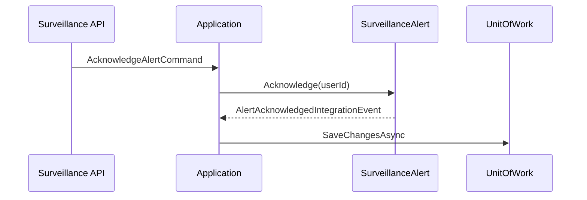

# Iteration 11 — Realtime Clinical Surveillance

Aligned with [realtime_fhir_dialysis_implementation_plan.md](realtime_fhir_dialysis_implementation_plan.md) §8.6 and [integration_event_catalog.md](integration_event_catalog.md) Realtime Surveillance section.

## Scope (learning MVP)

- `SurveillanceAlert` aggregate (`AggregateRoot`): states Active → Acknowledged | Escalated | Resolved; invalid transitions throw.
- `SessionRiskSnapshot` aggregate: one row per `SessionId`; `SessionRiskStateChangedIntegrationEvent` on change.
- **Commands:** raise alert, acknowledge, escalate, resolve, update session risk, evaluate stub rule (`MAP_BELOW_65` → raise hypotension alert if metric below threshold).
- **HTTP:** CRUD-style alert endpoints + session risk GET/PATCH.
- **Outbox:** existing `AlertRaisedIntegrationEvent`; add acknowledge/escalate/resolved/risk-changed CLR types in catalog assembly.
- **C5:** JWT `Dialysis.Surveillance.Read` / `Dialysis.Surveillance.Write`; audit on mutations.

## Mermaid (command flow)

## Files

- New: `platform/services/RealtimeSurveillance/**`
- Edit: `BuildingBlocks` authorization + OpenAPI transformers; `Tier1IntegrationEvents.cs` (or companion file); all `appsettings.json` under platform APIs; `OpenApiBearerSecurityScan.cs`; `ServiceLayeringRulesTests.cs`; `RealtimeFhirDialysisPlatform.slnx`; new test projects.

## Risks

- Rule engine deferred to stub; production would load rule sets from config service (Iteration 17).
