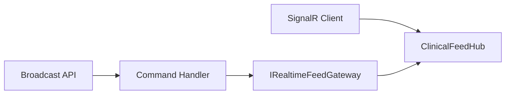

# Iteration 12 — Realtime Delivery

Blueprint [realtime_fhir_dialysis_implementation_plan.md](realtime_fhir_dialysis_implementation_plan.md) §8.12.

## MVP

- **Hub** `/hubs/clinical-feed`: `JoinSessionFeed` / `LeaveSessionFeed` / `JoinTenantAlerts` / `LeaveTenantAlerts` with groups `tenant:{tid}:session:{sid}` and `tenant:{tid}:alerts`.
- **Authorization:** `[Authorize(DeliveryRead)]` on hub; negotiate + WebSocket JWT via `access_token` query.
- **Push:** `IRealtimeFeedGateway` + `SignalRRealtimeFeedGateway` (`IHubContext<ClinicalFeedHub>`); commands `BroadcastSessionFeedCommand` / `BroadcastAlertFeedCommand`; REST `POST .../broadcast` (DeliveryWrite) for operators/integration placeholders.
- **Audit:** `FhirAuditRecorder` + `InMemoryAuditEventStore` (no EF/outbox for this edge service).
- **Port:** `5011`.

## Diagram

