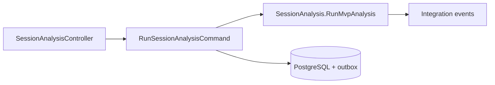

# Iteration 13 — Clinical Analytics

Blueprint: [realtime_fhir_dialysis_implementation_plan.md](realtime_fhir_dialysis_implementation_plan.md) §8.7, §1788.

## MVP

- **Aggregate:** `SessionAnalysis` + child `DerivedMetricLine` rows; factory `RunMvpAnalysis` emits catalog integration events.
- **Command:** `RunSessionAnalysisCommand` → audit + persist + outbox.
- **Query:** `GetSessionAnalysisById` for read API.
- **REST:** `POST .../sessions/{id}/analyses`, `GET .../analyses/{analysisId}` (`AnalyticsWrite` / `AnalyticsRead`).
- **Persistence:** PostgreSQL `clinical_analytics_dev`, outbox/inbox, EF audit table `clinical_analytics_audit_log`.
- **Port:** `5012`.

## Mermaid

