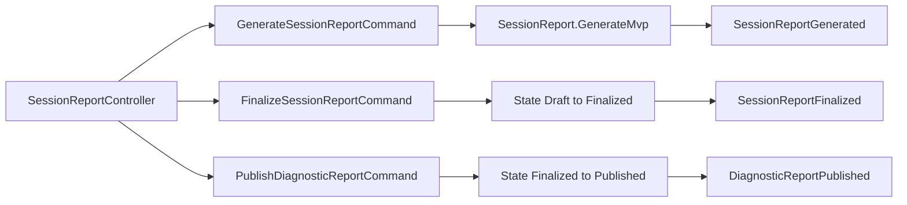

# Iteration 14 — Reporting

Blueprint: [realtime_fhir_dialysis_implementation_plan.md](realtime_fhir_dialysis_implementation_plan.md) §8.9, §1795; catalog [integration_event_catalog.md](integration_event_catalog.md) §Reporting.

## MVP

- **Aggregate:** `SessionReport` + ReportSection + SupportingEvidence; `GenerateMvp`, `FinalizeReport`, `PublishDiagnosticReport` with valid transitions only.
- **Commands:** generate, finalize, publish; **Query:** get by id.
- **REST:** `POST .../reporting/sessions/{id}/reports`, `POST .../reporting/reports/{id}/finalize`, `POST .../reporting/reports/{id}/publication`, `GET .../reporting/reports/{id}`.
- **Persistence:** PostgreSQL `reporting_dev`, outbox/inbox, `reporting_audit_log`.
- **Port:** `5013`.

## Mermaid

