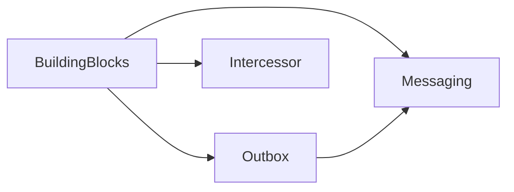

# Iteration 1 — Shared foundation

## Context

Aligns with `realtime_fhir_dialysis_implementation_plan.md` Milestone 0 / Iteration 1 and `docs/adr/ADR-0001-persistence-postgresql-redis-efcore.md`. `BuildingBlocks` currently references absent `Transponder*` projects; replace with in-repo **messaging + EF Core PostgreSQL outbox** so the solution builds.

## Deliverables

| Area           | Artifacts                                                                              |
| -------------- | -------------------------------------------------------------------------------------- |
| Messaging      | `ICorrelatedMessage`, `IEvent`, `IMessageSerializer`, JSON serializer                  |
| Outbox         | EF entity, `OutboxDbContext`, `EntityFrameworkOutboxStore`, shared-transaction staging |
| BuildingBlocks | `IIntegrationEvent` without Transponder; interceptor uses local outbox                 |
| Observability  | Host wiring helpers (Serilog + OpenTelemetry)                                          |
| Workflow       | Saga/workflow state placeholders for later orchestrator                                |
| Quality        | NetArchTest rules, `dotnet build` CI                                                   |
| Docs           | Integration event fields; Clean Architecture folder template                           |

## Risks

- Outbox interceptor must share `IDbContextTransaction` with application `DbContext`; apps must use Npgsql and compatible transaction flow.

## Dependency flow

