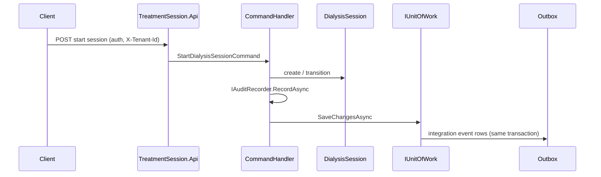
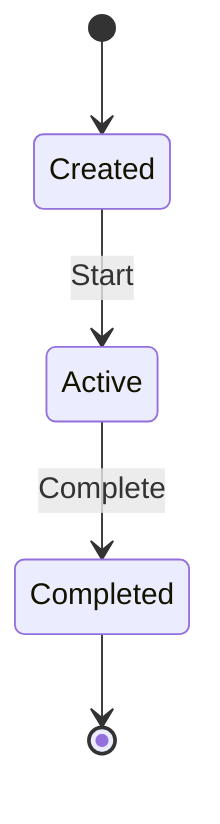

## Readiness

`[.cursor/plans/iteration_1_shared_foundation.plan.md](iteration_1_shared_foundation.plan.md)`, `[.cursor/plans/iteration_2_device_registry.plan.md](iteration_2_device_registry.plan.md)`, and `[.cursor/plans/iteration_3_measurement_acquisition.plan.md](iteration_3_measurement_acquisition.plan.md)` are complete. `[.cursor/plans/realtime_fhir_dialysis_implementation_plan.md](realtime_fhir_dialysis_implementation_plan.md)` §1691–1728 places **Iteration 4 — Treatment Session Service** next; no `TreatmentSession`* projects exist yet under `platform/services/`.

## Alignment

| Source                                                          | Expectation                                                                                                                                                                                                                                                                                                                                                                                         |
| --------------------------------------------------------------- | --------------------------------------------------------------------------------------------------------------------------------------------------------------------------------------------------------------------------------------------------------------------------------------------------------------------------------------------------------------------------------------------------- |
| Blueprint §8.3                                                  | `DialysisSession`, session lifecycle, patient/device correlation, `SessionId` and state VO                                                                                                                                                                                                                                                                                                          |
| Catalog §2 Treatment Session                                    | e.g. `DialysisSessionStartedIntegrationEvent`, `PatientAssignedToSessionIntegrationEvent`, `MeasurementContextResolvedIntegrationEvent` — implement **MVP subset** in Iteration 4; defer full pause/resume/fail matrix if needed to keep slice shippable                                                                                                                                            |
| `[.cursor/rules/c5-compliance.mdc](../rules/c5-compliance.mdc)` | JWT on business endpoints, tenant header, audit on security-relevant mutations                                                                                                                                                                                                                                                                                                                      |
| Siblings                                                        | Same patterns as `[DeviceRegistry.Api/Program.cs](../../platform/services/DeviceRegistry/DeviceRegistry.Api/Program.cs)` and `[MeasurementAcquisition.Api/Program.cs](../../platform/services/MeasurementAcquisition/MeasurementAcquisition.Api/Program.cs)`: `AddDialysisPlatformC5WebApi`, `AddDialysisPlatformOpenApi`, `Ef*AuditEventStore` + `FhirAuditRecorder`, outbox relay, optional Redis |

Shared value object: `[BuildingBlocks/ValueObjects/SessionId.cs](../../BuildingBlocks/ValueObjects/SessionId.cs)`.

## MVP scope (Iteration 4)

1. **Session aggregate** with explicit **persisted state machine** (minimal states: e.g. Created → Active → Completed; invalid transitions throw).
2. **Commands (HTTP v1):** start/create session, assign patient (MRN or platform id string per existing patterns), link device to session, complete/end session, optional “mark measurement context resolved/unresolved” if measurement id + session id are enough for a first cut.
3. **Persistence:** dedicated PostgreSQL database (`treatment_session_dev` or equivalent in `appsettings.json`).
4. **Outbox:** catalog-aligned integration events with envelope (`TenantId`, `RoutingDeviceId` / `SessionId` on `IntegrationEvent` as appropriate).
5. **Tests:** state transition unit tests; command handler tests with capturing `IAuditRecorder`; integration project with OpenAPI document tests.

## Deferred to later iterations

- Full pause/resume/failed/cancelled flows and all catalog events under Treatment Session.
- Inbox consumer that correlates `MeasurementAcceptedIntegrationEvent` from Measurement Acquisition (cross-service wiring can follow once session API is stable).
- FHIR Encounter/Procedure linking (Clinical Interoperability milestone).

## Workflows

## Files to add (expected)

- `platform/services/TreatmentSession/TreatmentSession.Domain/`
- `platform/services/TreatmentSession/TreatmentSession.Application/`
- `platform/services/TreatmentSession/TreatmentSession.Infrastructure/`
- `platform/services/TreatmentSession/TreatmentSession.Api/`
- `tests/TreatmentSession.UnitTests/`, `tests/TreatmentSession.IntegrationTests/`
- Update `[RealtimeFhirDialysisPlatform.slnx](../../RealtimeFhirDialysisPlatform.slnx)`

## Risks

- **Scope creep:** cap MVP to start + assign + complete + one correlation signal; add pause/resume in a follow-up plan.
- **Identity strings:** use existing `MedicalRecordNumber` / `DeviceId` value objects at application boundaries where handlers already do in sibling services.

## Implementation gate

Per `[.cursor/rules/plan-before-implement.mdc](../rules/plan-before-implement.mdc)`, no implementation work starts until this plan is acknowledged; then execute todos top-down.
