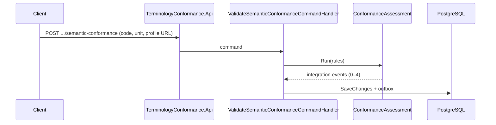

# Iteration 8 — Terminology Conformance Service

Blueprint §8.11 and delivery plan Iteration 8. **MVP:** `ConformanceAssessment` aggregate, POST/GET semantic-conformance on `api/v1/resources/{resourceId}/…`, deterministic terminology + FHIR profile URL rules, outbox + audit; defer full ValueSetBinding registry and FHIR instance validation.

## Workflows

## Files

- `RealtimePlatform.IntegrationEventCatalog/Tier1IntegrationEvents.cs` (or append) — four terminology events
- `BuildingBlocks` — policies, scopes, `ConfigureDialysisAuthorizationOptions`, OpenAPI transformers
- `tests/Shared/OpenApiBearerSecurityScan.cs`
- All sibling `appsettings.json` under `platform/services/*/Api`
- New `platform/services/TerminologyConformance/**`
- `RealtimeFhirDialysisPlatform.slnx`, architecture + unit + integration test projects

## Risks

- Scope sprawl; keep MVP payloads aligned with `integration_event_catalog.md` names only.
