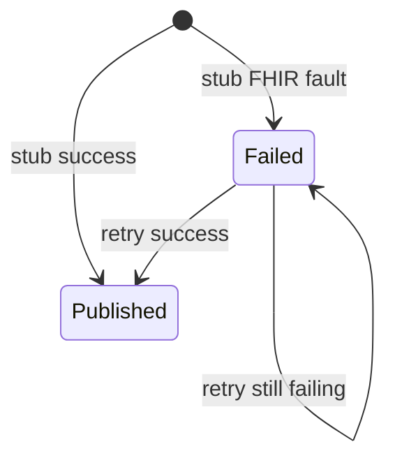

# Iteration 9 — Clinical Interoperability Service

Blueprint §8.8. **MVP:** `CanonicalObservationPublication` aggregate (stub FHIR write, Published vs Failed), POST publish + POST retry + GET latest; `CanonicalObservationPublishedIntegrationEvent` / `CanonicalObservationPublicationFailedIntegrationEvent`; defer real Firely client and bundle assembly.

## State machine (MVP)

## Files

- `Tier1IntegrationEvents.cs` — failure event record
- BuildingBlocks authorization + OpenAPI
- `platform/services/ClinicalInteroperability/**`
- `RealtimeFhirDialysisPlatform.slnx`, tests, sibling `appsettings.json`
