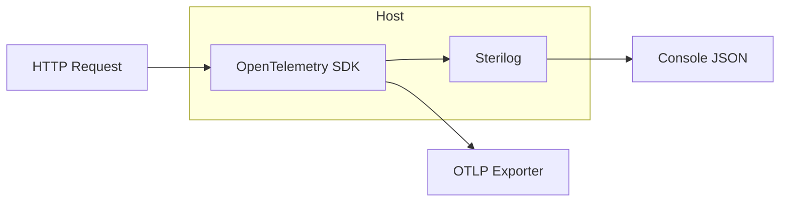

## Context

`RealtimePlatform.Observability` already registers Serilog from configuration and OpenTelemetry (ASP.NET Core, HttpClient, runtime) with OTLP exporters on every platform API and the gateway. Aspire AppHost injects OTLP endpoint environment variables for dashboard consumption during orchestrated runs.

## Scope

- **Logs ↔ traces**: Add a Serilog enricher (in Observability only) so structured logs include `TraceId` and `SpanId` from `Activity.Current`.
- **Resource attributes**: Set `deployment.environment` and `service.version` (from entry assembly informational version when present) on the OTEL resource alongside `service.name`.
- **Cleanup**: Delete `BuildingBlocks.Logging.ActivityEnricher`, which is unused and duplicates the above behavior.

## Out of scope (follow-up)

- Prometheus scrape endpoint (package is pinned beta; add when product requirement is clear).
- EF Core / MassTransit instrumentation packages (per-service follow-up).
- New documentation files (not requested).

## Files

- `platform/shared/RealtimePlatform.Observability/ObservabilityWebApplicationBuilderExtensions.cs` — configure resource + Serilog enricher chain.
- `platform/shared/RealtimePlatform.Observability/OpenTelemetryTraceContextEnricher.cs` — new.
- `BuildingBlocks/Logging/ActivityEnricher.cs` — remove.

## Risks

- None for runtime behavior; enricher is additive. OTLP still requires `OTEL_EXPORTER_OTLP_ENDPOINT` (or Aspire-provided defaults) in the environment.
