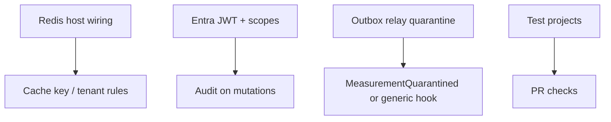

## Context

These items were explicitly **out of scope** for iterations 1–3 but are required for production hardening and catalog completeness.

## Dependency hints

## Notes

- **Quarantine event:** Today `[OutboxRelayBackgroundService](../../platform/shared/RealtimePlatform.Outbox/OutboxRelayBackgroundService.cs)` sets `QuarantinedAt` only. Emitting catalog integration events should use an abstraction (for example `IQuarantineNotifier` / `IOutboxLifecycleObserver`) implemented in the host or a thin BuildingBlocks adapter so `RealtimePlatform.Outbox` does not reference `MeasurementAcquisition.Domain`.
- **C5:** Align with workspace `.cursor/rules/c5-compliance.mdc` and existing ADRs under `docs/adr/`.

