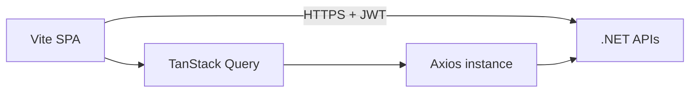

# React client (PDMS learning UI)

## Context

Bounded-context APIs are .NET; this client is a separate SPA for dashboards and FHIR-oriented views. Compliance is enforced at API (auth, audit); the UI adds transport safety (HTTPS), role-gated rendering, and avoids persisting secrets in `localStorage` by default.

## Workflows

## Files

- `clients/pdms-web/` — new Vite project
- `.env.example` — `VITE_API_BASE_URL` only; no secrets in repo

## Risks

- True E2E payload encryption beyond TLS requires key management not in scope; document TLS + server-side encryption at rest.
