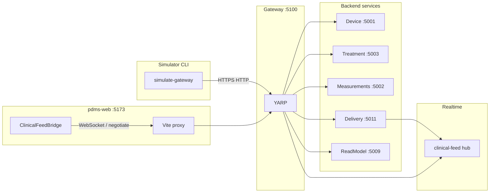

# Use case: simulator inserts data → React realtime updates

## 1. Purpose

- **Simulator** (`[tools/Simulation.GatewayCli](../../tools/Simulation.GatewayCli/README.md)`): HTTP only to `**RealtimePlatform.ApiGateway`** (default `http://localhost:5100`). It creates domain data (device, session, patient, measurement) and can **push delivery broadcasts** that become **SignalR** messages.
- **React app** (`[clients/pdms-web](../../clients/pdms-web/README.md)`): `**ClinicalFeedBridge`** connects to `**/ hubs/clinical-feed**` (dev: Vite proxy → gateway), joins **session** and/or **tenant alerts** groups, and merges payloads into **TanStack Query** (`setQueryData`).

There are **two channels**:


| Channel        | Transport                                                                            | Drives (examples)                                                                          |
| -------------- | ------------------------------------------------------------------------------------ | ------------------------------------------------------------------------------------------ |
| **Realtime**   | SignalR `sessionFeed` / `alertFeed`                                                  | Session feed tail, in-memory alert feed, light touch on cached session overview timestamps |
| **Read model** | `GET /api/.../alerts`, `GET .../dashboard/summary`, `GET .../sessions/{id}/overview` | Dashboard dropdowns, counts; persists in QueryReadModel DB                                 |


**Important:** `scenario run` ends with `**delivery/broadcast/session`**, which **does** feed SignalR for that **session group**. It does **not** today write `**alert` projections** or call `**broadcast alert`**; dropdowns fed by `**GET /alerts**` stay empty for the new session until something **POST**s `**/projections/alerts`** or you use **rebuild/seed** (`[ReadModelProjectionMaintenance](../../platform/services/QueryReadModel/QueryReadModel.Infrastructure/Persistence/ReadModelProjectionMaintenance.cs)`).

## 2. Actors and prerequisites




- **Tenant:** Same `**X-Tenant-Id`** on CLI (`--tenant` / `SIMULATION_GATEWAY_TENANT`) and `**VITE_APP_TENANT_ID**` in the browser (see `[httpClient](../../clients/pdms-web/src/api/httpClient.ts)` interceptor).
- **Auth:** Development often uses **JWT bypass** on gateway/services; production-shaped runs need a bearer with `**DeliveryWrite`**, `**SessionsWrite**`, etc.
- **RealtimeDelivery** must be up so `**POST .../delivery/broadcast/*`** can publish to the hub.

## 3. Sequence (happy path)

```mermaid
sequenceDiagram
  participant Op as Operator
  participant CLI as Simulation.GatewayCli
  participant GW as ApiGateway
  participant Svc as Domain APIs
  participant Del as RealtimeDelivery
  participant Hub as SignalR clinical-feed
  participant Web as pdms-web

  Op->>CLI: scenario run --tenant T
  CLI->>GW: POST devices, sessions, patient, device link, start, measurements
  GW->>Svc: persist line-of-business data
  CLI->>GW: POST delivery/broadcast/session
  GW->>Del: BroadcastSessionFeedCommand
  Del->>Hub: PushSessionAsync tenant + sessionId
  Op->>Web: Open /dashboard?sessionId=ULID
  Web->>Hub: connect; JoinSessionFeed(sessionId); JoinTenantAlerts
  Note over Web,Hub: sessionFeed events append session tail / bump overview cache
```


## 4. Operator steps — insert data (CLI)

1. From repo root, ensure gateway and services are listening per `[appsettings.json](../../platform/gateway/RealtimePlatform.ApiGateway/appsettings.json)` clusters (device **5001**, measurement **5002**, treatment **5003**, query-read-model **5009**, realtime-delivery **5011**, …).
2. Run scenario (stderr progress; **stdout** = JSON summary):

```bash
   ./scripts/run-simulation-gateway-cli.sh --tenant <your-tenant> scenario run --prefix demo
   

```

   Or `dotnet run --project tools/Simulation.GatewayCli -- --tenant <your-tenant> scenario run`.
3. Copy `**treatmentSessionId**` from the JSON line.
4. **Optional realtime checks:**

- Extra session ping:

```bash
     ./scripts/run-simulation-gateway-cli.sh --tenant <your-tenant> broadcast session \
       --session-id <ULID> --event-type Simulation.Manual --summary "ping"
     

```

- Tenant-wide **alert** channel (requires `**JoinTenantAlerts`** in UI — enabled in dev or with `[realtimeFeedRoles](../../clients/pdms-web/src/auth/rolePolicies.ts)`):

```bash
     ./scripts/run-simulation-gateway-cli.sh --tenant <your-tenant> broadcast alert \
       --session-id <ULID> --alert-id demo-1 --severity High --state Active --event-type Simulation.Alert
     

```

## 5. Operator steps — observe in React

1. `**clients/pdms-web`:** set `**VITE_APP_TENANT_ID`** = same tenant as CLI; set roles if you rely on non-dev gating (`[ClinicalFeedBridge](../../clients/pdms-web/src/realtime/ClinicalFeedBridge.tsx)` `mayUseFeed` / `joinTenantAlerts`).
2. `**npm run dev**` — connect to `**http://localhost:5173**` (Vite proxies `**/api**`, `**/hubs**`, `**/health**` to **5100**).
3. Navigate to the **dashboard** with `**?sessionId=<treatmentSessionId>`** so `**JoinSessionFeed**` runs (`[invoke('JoinSessionFeed', opts.sessionId)](../../clients/pdms-web/src/realtime/ClinicalFeedBridge.tsx)`).
4. Confirm hub state (banner / context) shows **connected**; check **session feed tail** (or any UI bound to `queryKeys.sessionFeedTail(sessionId)`).
5. From another terminal, run `**broadcast session`** (step 4.4); the dashboard should receive `**sessionFeed**` without full page reload — payloads merge via `**setQueryData**` (`sessionFeedTail`, session overview projection timestamp).

## 6. What updates in the UI (code anchors)

- **Session feed:** `connection.on('sessionFeed', …)` → `queryKeys.sessionFeedTail(sid)` (`[ClinicalFeedBridge.tsx](../../clients/pdms-web/src/realtime/ClinicalFeedBridge.tsx)`).
- **Tenant alerts feed:** `alertFeed` → `queryKeys.tenantAlertsFeed()`.
- **Read-model lists/counts:** Refetch or invalidate only if you depend on `**GET /alerts`** / `**GET /dashboard/summary**`; SignalR does **not** replace those DB-backed endpoints.

## 7. Verification checklist

- `GET http://localhost:5100/health` returns healthy gateway.
- CLI scenario completes with `**OK`** lines and prints JSON with `**treatmentSessionId**`.
- Browser Network: `**/api/v1/...**` (if used) returns **200**; SignalR **negotiate** + **WebSocket** to `**/hubs/clinical-feed`** succeed.
- With `**?sessionId=**` set, firing `**broadcast session**` for that id updates the **session feed** cache in the UI.
- (Optional) `**broadcast alert`** updates **tenant** alert feed when `**JoinTenantAlerts`** is active.
- (Optional) `**GET /alerts**` shows rows only after **projections** exist or **seed** — not solely from `**scenario run`**.

## 8. Risks and follow-ups

- **Stale read model:** Overview / alerts HTTP may lag messaging; after reconnect, `[ClinicalFeedBridge](../../clients/pdms-web/src/realtime/ClinicalFeedBridge.tsx)` invalidates **session overview** for the URL session id.
- **CORS / hub URL:** Dev must use **same-origin** `/hubs/...` (see `[clinicalFeedHubUrl()](../../clients/pdms-web/src/realtime/ClinicalFeedBridge.tsx)`); avoid pointing the hub at **:5100** from the Vite origin unless CORS is explicitly configured for that shape.
- **Product gap (optional):** Extend `**scenario run`** with `**broadcast alert**` and/or `**POST /projections/alerts**` so dashboard dropdowns and realtime stay aligned without manual steps — track as separate implementation work if desired.

## 9. Alignment with existing docs

- Harness design: `[.cursor/plans/simulated_data_console_harness.plan.md](./simulated_data_console_harness.plan.md)`
- React bridge: `[.cursor/plans/react_query_signalr_bridge.plan.md](./react_query_signalr_bridge.plan.md)`
- Dev environment: `[docs/DEVELOPMENT-ENVIRONMENT.md](../../docs/DEVELOPMENT-ENVIRONMENT.md)` (if present in tree)

