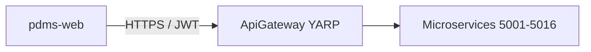

# YARP gateway

## Behavior

- **Reverse proxy / load balancer**: YARP clusters target each microservice Kestrel URL; `LoadBalancingPolicy` `RoundRobin` when multiple destinations are listed (scale-out).
- **Auth**: Same C5 JWT pipeline as APIs; forward `Authorization`, `X-Tenant-Id`, and correlation id. In Development with `DevelopmentBypass`, proxy does not require an authenticated principal (matches downstream bypass).
- **Health**: Gateway `/health` is anonymous liveness; microservice health remains on each service.

## Mermaid

